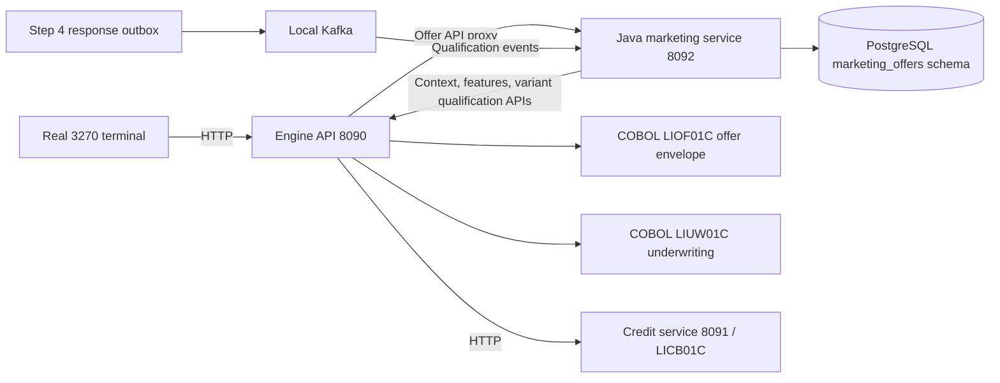

<!-- Explains local cohort training, bounded personalization, customer choices and their comparison metrics. -->
# Step 5: local personalized offers

Step 5 is an independent **Java 17 marketing microservice**. It consumes Step 4 qualification events, creates original/personalized choices, and owns offer storage in PostgreSQL. The original approved catalog offer remains available. A personalized choice has different financial terms and its own authoritative variant qualification. Neither selection issues a loan or sends a marketing message.

## Run and use

From the project directory in PowerShell:

```powershell
.\scripts\infrastructure.ps1
.\scripts\test-bureau.ps1
.\scripts\run.ps1
```

Open another PowerShell window:

```powershell
.\scripts\terminal.ps1
```

The run script supervises three separate JVMs: credit bureau **8091**, engine **8090** (TN3270 **2323**), and marketing offers **8092**. Ctrl+C stops all three. Marketing startup/worker logs are in `runtime/marketing-service.log`. The existing private `runtime/local.env` supplies PostgreSQL and Kafka configuration; do not copy credentials into source control. No additional language/runtime installation is needed beyond the existing Java 17/Maven/GnuCOBOL/WSL and Docker setup.

The service can also run independently with `bash scripts/run-marketing.sh` inside WSL, after the engine has created its service credentials. Do not run that command while the normal supervisor already owns port 8092.

Since Step 7, saving a customer automatically runs qualification through file generation. Cold-start synthetic training and completed simulation-batch training also run automatically. The following controls remain available for explicit admin operation; they are no longer required for each new customer. See [campaign-execution.md](campaign-execution.md).

Admin workflow:

1. Use the existing **Step 1 simulation** to create 60–10,000 synthetic customers. Record the completed batch ID. Manual customer entry continues to work independently.
2. In the main menu choose **9 → 7 → 1**. Supply that batch ID and a model seed. Training runs asynchronously. **9 → 7 → 4** shows jobs and model quality. Synthetic profiles supply training data; no bureau approval is needed for model training.
3. Run the existing Step 1 pre-screen population, Step 2 preview/finalization, and Step 3 bureau qualification. Training never bypasses these eligibility gates. Independent generated bureau facts can decline customers; use the existing bureau import/edit screens when testing a specific approved case.
4. Step 4 publishes `marketing.qualification.updated.v1`. Step 5 consumes it automatically and also recovers current responses through a bounded API scan.
5. For eligible responses, the original offer activates first. With no trained model, it is labeled `WAITING_FOR_MODEL`. Once training completes, pending customers automatically receive personalization processing.
6. The model assigns a cohort. The optimizer compares allowed financial terms for customer fit, and submits candidates to the engine. Only a variant approved by the COBOL envelope, underwriting simulator and credit bureau can activate. If none improves fit and qualifies, the original remains available with `NO_QUALIFIED_IMPROVEMENT`.
7. Choose **9 → 7 → 2**, enter the customer ID, and compare original/personalized amount or limit, APR, annual fee, repayment term, monthly payment and borrowing cost. **O** selects original; **P** selects personalized. Each is a local demonstration selection recorded with exact terms. Eligibility is checked again at presentation and selection.
8. Admin options **3** and **6** show offer-level comparisons/history and aggregate simulation metrics. Option **5** shows service, queue, Kafka and storage status. “Created/active” means available in this local application; this step does not distribute outbound marketing files.

## Architecture and ownership



The service is built as `marketing-service/target/marketing-offers-1.0.0.jar`; it has no engine Java dependency and never queries engine-owned H2 or bureau tables. Its schema owns its inbox, work leases, offers, offer history, selections, training jobs, models and backfill cursor. The demo uses the existing database account across schemas; separate deployment identities/grants remain production work.

The engine owns `offer_variant_qualifications`, added by **V003__offer_variants.sql**. Existing V001/V002 migrations and customer data remain unchanged. New service migrations are independently checksum verified. Deleting/resetting runtime data is unnecessary.

The scoped `runtime/marketing-source-token` authorizes only `/api/v1/offer-source/…`. The separate `runtime/marketing-api-token` protects the microservice. The terminal uses the operator engine token and the `/api/v1/offer-creation/…` proxy. All local listeners bind to loopback. Admin/customer screens are demonstration modes under a local operator credential, not production end-user authentication or RACF authorization.

## What the ML and simulation do

`KMEANS-LOCAL-1` fits actual cluster centers to synthetic financial/behavioral features: log income, debt/income, utilization, log tenure, savings/income and spending/income. Identifiers, names, raw customer text and bureau credit scores are not features. Missing values use documented defaults in the feature transformation; unknown values do not become credit approval evidence.

Training shuffles a deterministic customer-ID-sorted dataset with the supplied seed and splits **60% training / 20% validation / 20% test**. Scaling uses training rows only. K-means++ initialization searches 2–6 cohorts, three restarts, up to 40 iterations; candidate cohorts need at least five training members. Validation silhouette selects the model, using up to 200 validation points. The held-out test silhouette is reported separately. A constant/unusable batch fails explicitly; there is no fabricated trained model fallback. Training is bounded to 10,000 profiles per job.

Models persist feature order, means/scales, centroids, cohort preference weights, seed, source batch, materialized dataset hash and evaluation counts. The latest successfully completed model becomes active for new/pending creations. Existing completed offers retain their model version. Training another model does not silently reprice existing offers.

`CUSTOMER-FIT-SIM-1` scores each candidate using affordability, borrowing cost, closeness to the customer's requested amount and a shorter-term preference. Weights combine the customer's deterministic financial preferences (70%) and learned cohort-average preferences (30%). The same weights and formula score the original offer and every candidate; there is no bonus merely for being personalized. Candidate selection and customer offer ordering optimize fit, not lender profit.

Search examines up to 108 combinations: three amount choices, four APR reductions, three fee choices, and three term choices (cards have zero term). Duplicate/unchanged/out-of-envelope candidates are removed. Only fit improvements greater than 0.01 points are submitted; at most 12 ranked candidates receive authoritative requalification. A cheaper loan may have a higher monthly payment; the comparison retains both payment and total-cost changes.

**Acceptance is a utility simulation, not a trained/calibrated response prediction.** It is a sigmoid transformation of the fit score, with zero observed acceptance labels. It cannot establish real acceptance uplift, profitability, causal benefit or fairness. Loan payment/cost uses amortization plus annual fees. Credit-card payment assumes 3% of the limit plus monthly fees; card borrowing cost assumes a full-limit balance for one year. These explicit assumptions support local experiments, not an actual repayment schedule or production credit disclosure.

Admin aggregates compare original and personalized offers for the same customer/model, grouped by product/model: personalization coverage, mean fit uplift, simulated acceptance percentage-point change, payment/cost changes and number of variants with higher total cost. Null means no personalized comparisons. These are stored-state audit metrics and may lag eligibility reconciliation. Cohort quality is model evaluation, not evidence of protected-group fairness; that assessment remains unestablished.

## Qualification and configurable policy

`app/data/offer-personalization-policy.json` supplies demonstration values. `LIOF01C.cbl` owns the envelope rule and `LIOBAT01.cbl` owns only fixed-record transport. Java owns process/HTTP/database adapters, not an alternative numerical approval implementation. A policy identifier includes the named version and configuration hash.

Defaults:

| Constraint | Demonstration value |
|---|---|
| APR reduction | 0–2 percentage points below the qualified catalog APR |
| APR floor | Personal 6%, card 9%, auto 4% |
| Amount/limit | Within catalog min/max and ±10% of the assessed amount |
| Annual fee | May reduce to zero; may not increase |
| Loan term | Within 12–84 months and ±12 months of the catalog term |
| Credit-card term | Zero |

An original catalog offer outside the personalization envelope is still its own qualified original; a policy floor never increases its APR. Edit configuration and restart the engine to change the envelope. Existing personalized qualifications from the old policy hash become invalid at their next current read/reconciliation. The original can remain active if its source qualification is valid. Re-run qualification for a new personalized family when changing approved catalog/campaign terms.

Variants retain the original product/campaign/catalog ID and version. They cannot select another offer. The existing Step 2 reservation covers that customer's alternative choices; variant processing does not consume another campaign reservation. The engine verifies current Step 2 evidence and current Step 4 response, evaluates the proposed amount through Step 1 COBOL without changing the customer, and obtains a new Step 3 credit assessment for exact proposed amount/APR/term. It records the approval and its expiry. The model is never an eligibility authority.

## Event handling, restart and visibility

The consumed contract is the existing [Step 4 qualification event](../contracts/decision-response.schema.json). Risk ID is the Kafka key. The service validates envelope/version/key, commits its PostgreSQL inbox/work transaction, then commits the Kafka offset. Malformed/conflicting events go to durable `rejected_events` with a fingerprint/reason, not an automatic offer. No full raw bureau response is consumed.

Event IDs deduplicate delivery and source response versions prevent late events from resurrecting old eligibility. Newer source revisions invalidate existing offer families immediately in the inbox transaction. Leased work uses `FOR UPDATE SKIP LOCKED`, version/token fences, bounded retries and atomic offer/history writes. Training jobs and API backfill cursors survive restarts. Historical qualification responses can be recovered even if Kafka retention has removed their events. The current-response scanner continuously pages 100 records at a time.

The service periodically reconciles up to 50 active families and rechecks current engine eligibility. Consent withdrawals, suppression, cancelled campaigns and expiry therefore withdraw choices automatically. Source failures do not become credit declines. Customer reads/choices fail closed on unavailable authority; admin audit remains available. Expired/invalid variant approvals withdraw the personalized alternative while retaining a still-qualified original. No cross-service distributed transaction is claimed: concurrent changes after the final source check can race a demo selection; actual funding would require a separate authoritative transactional acceptance operation.

Ranked customer pages use fit-descending/ID keyset cursors. Follow `nextAfter` even when all entries on a page were filtered by fresh eligibility. Reconciliation can change ranking between pages, so refresh the list after a source change. Operator pages use offer IDs and include withdrawn history. Selection replay is idempotent while the offer is current; an old request cannot bypass current eligibility.

## API and capacity

See [marketing-offers.openapi.yaml](../contracts/marketing-offers.openapi.yaml). Direct service routes are under `http://127.0.0.1:8092/api/v1`; the same routes are proxied under engine `/api/v1/offer-creation`.

| Method/path | Purpose |
|---|---|
| `POST /training` | Queue `{batchId, seed}` |
| `GET /training`, `GET /models` | Latest 50 jobs/models; retained artifacts stay in SQL |
| `GET /offers?after=&limit=20` | Operator audit, including revoked families |
| `GET /customers/{id}/offers?after=&limit=20` | Current choices, ranked by customer fit |
| `GET /offers/{id}` | Fresh original/personalized comparison |
| `POST /offers/{id}/selections` | `{requestId, sourceVersion, kind: ORIGINAL or PERSONALIZED}` |
| `GET /offers/{id}/history?after=0` | Next 50 immutable history entries |
| `GET /metrics`, `GET /health` | Simulation aggregates / technical state |

Engine-only service-source routes supply bounded features, current response pages, context, variant qualification and approval revalidation. All are authenticated. API tokens and customer information stay local.

This is not a million-customer throughput claim. The offer service supports partitioned Kafka consumption, multiple leased workers/instances, pooled PostgreSQL and asynchronous recovery, but this local topology runs two creation workers and one trainer. The existing H2 Step 1/2 source remains serialized; repeated eligibility scans, per-candidate COBOL processes, and the upstream publisher are bottlenecks. Large deployments need measured load tests, source change feeds/index tuning, bounded retention/archiving, replicated Kafka, separate service database users, authenticated customer identity, secure transport and transactional final acceptance. No existing tables or Kafka volumes are pruned by this implementation.

## BIAN reference

The official [BIAN Customer Offer v14 semantic API](https://raw.githubusercontent.com/bian-official/public/main/release14.0.0/semantic-apis/oas3%20/yamls/CustomerOffer.yaml) describes offer processing, product options/pricing and related eligibility/credit assessment. It informs the service boundary and variant qualification trace. BIAN does not supply this project's numerical APR/fee/underwriting limits or require these exact fields; the policies here remain named, versioned demonstrations. This is a BIAN-informed local implementation, not a conformance claim.

Kafka's [consumer documentation](https://kafka.apache.org/41/javadoc/org/apache/kafka/clients/consumer/KafkaConsumer.html) describes manual offset control; this implementation acknowledges after its durable inbox commit and tolerates duplicate delivery.
